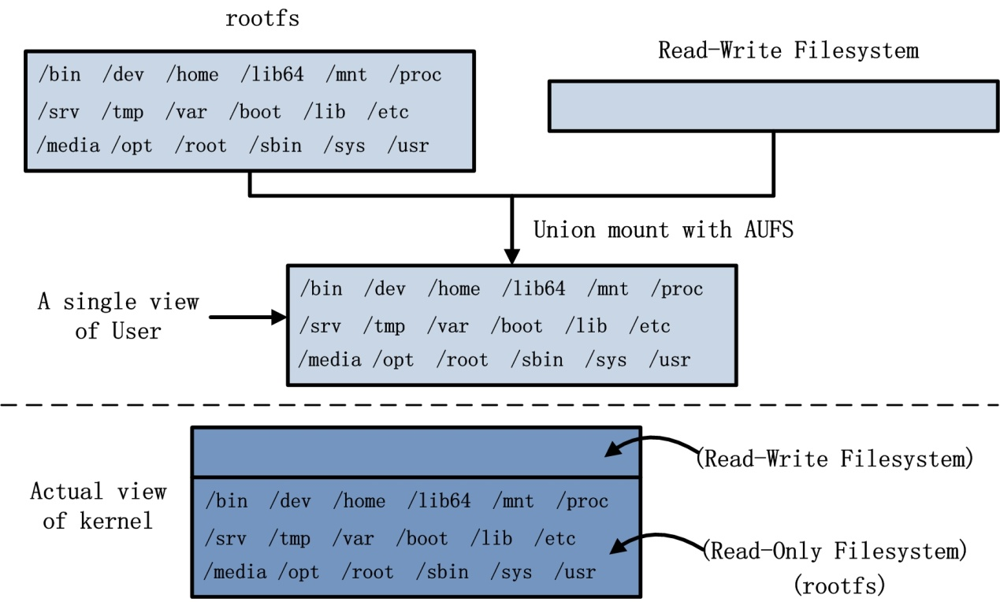

# docker学习笔记整理

- 基础
  - 背景和基本概念
  - 基本命令
    - 启动和删除
    - Dockerfile创建镜像
  - Volume使用

- 案例
  - 一个简单的web应用

## 1. 基础

> ### 背景

  docker于2013年开始创建的一个业余项目，自从开源以来，不断的发展。它是一种轻量，快速的虚拟化技术。基于LXC容器进一步封装，省去了对容器的管理。与传统虚拟机不同的是，docker创建的容器是在操作系统层面实现的虚拟化，如  

  从图中可以看出docker是让容器共用了引擎，共用了内核，同时保证了各个项目之间的空间独立。但我自己还不清楚和传统虚拟机保证在同一个虚拟主机里面运行不同的项目的根本区别在哪里？仅仅是启动速度快和项目之间的隔离么？在比较docker和传统虚拟机时，单个比较一个容器就是一个传统虚拟机是不太公平的吧，为什么一个项目就非得用一个虚拟机，而不是一个虚拟机承载多个项目呢？（考虑到单个项目的故障，会影响所在虚拟机其他项目么）

  但不管怎么说，docker在快速交付，构建标准部署方面有很大优势，因为如果有一个hub共有docker引擎，对于一个公司所有开发人员来说都是极为有益的，同时也便于管理各个开发出来的工具。更重要的是性能是杠杠的，几乎和在原来系统上运行一个命令一样快。

> ### 基本概念

- 镜像

  镜像是docker启动容器的基础，包括了4个相关的概念，rootfs, union mount, image, layer. rootfs是系统镜像文件系统（只读），而在内核启动的时候通过union mount方式另外又加载了一个可读可写的文件系统。内核可以明显的区分开这两种文件系统，但是对于用户接触的是一个融合的AUFS文件系统，通过更新或者隔绝对用户的可见性，让用户觉得是修改了rootfs的系统文件。而docker将系统rootfs分割成不同的image，通过将image组装，从而构成一个完整的rootfs。而layer与image类似，但是包括了union mount加载的可读可写的文件系统。docker就是通过这样将系统分割成不同image，让不同的容器可以共享相同的文件系统块，从而降低了很多空间。下面是一个

- 容器

  容器是docker镜像的一个实例，相当于启动起来的一个linux虚拟机，但是启动效率十分的高。又像是一个应用程序，随用随弃都可以。

- 仓库

  仓库是用来存放docker镜像的地方。最大的公开仓库自然是官方的[DOCKER HUB][5]，国内有[网易蜂巢][6]等。如果本地没有镜像文件就会到官网去搜索同名的镜像文件进行下载安装

> ### 常用命令

完整请看参考中的**docker cheat sheet**.

- 获取镜像

  - `docker search -s 10 ubuntu`， 搜索评分超过10的ubuntu的镜像。
  - `docker pull ubuntu:14.04`, 获取ubuntu 14.04版本的镜像。
  - `docker pull hub.c.163.com/library/alpine:latest`，从网易云获取alpine镜像

- 启动容器

  - `docker run --rm -it alpine /bin/ash` 交互访问alpine镜像，并执行`/bin/ash`命令，同时停止容器的时候删除容器
  - `docker run -d -p 8080:8080 alpine python ./app.py` 后台运行python web并将其绑定在主机端口8080上
  - `docker run -it -v /home/data:/data alpine /bin/ash` 将主机上`/home/data`目录共享到虚拟机中的`/data`

- 停止删除容器

  - `docker stop <id>`, 停止一个容器，id可以不用写完。交互可以直接`ctrl + D`退出
  - `docker rm <id>`，删除一个容器
  - `docker rm -v <id>`，同时删除共享的volume文件夹，如果在主机中存在就不会被删除（不是在主机容器镜像存放的位置的文件夹）
  - `docker rm -f $(docker ps -aq)`, 删除所有容器，包括正在运行的容器，停止并删除
  - `docker rm $(docker ps -aq -f status=exited)`, 删除已退出的容器

- 查看容器状态

  - `docker ps -a`， 查看所有容器状态

- 保存和加载镜像

  - `docker save jupyter/all-spark-notebook:latest | gzip -c > ./all-spark-notebook.tgz` 将镜像打包导出
  - `gunzip -c ./all-spark-notebook.tgz | docker load` 重新加载镜像

  *容器可以保存快照和加载*

- 临时传送本地文件和容器内文件

  - `docker cp`

- 创建容器互联的网络

  - `docker network`

> ### Dockerfile创建

以`#`作为注释，其他用`INSTRUCTION arguments`，进行指令的说明

常用的指令包括：

- `FROM`, 指定从什么镜像创建镜像，最低的一层是`scratch`镜像
- `MAINTAINER`, 指定维护这信息
- `RUN`, 在创建镜像后执行的命令，通常是用来构建镜像环境
- `ENV` var val, 镜像中的环境变量
- `EXPOSE`, 暴露服务端容器的端口，通过这个接口访问容器
- `ADD` src dest, 复制本地文件或者网络文件到容器路径中, tar自动解压成目录
- `COPY` src dest, 复制本地文件，推荐用
- `ENTRYPOINT`，配置容器启动后的命令，且不能被`docker run`提供的参数覆盖
- `CMD`, 提供默认的镜像执行命令或者ENTRYPOINT的参数
- `VOLUME`, 容器中挂载主机或者其他容器的目录路径
- `USER`, 指定运行命令的用户，后续命令是有指定的用户执行，默认是root用户。
- `WORKDIR`, 为后续的RUN, CMD, ENTRYPOINT指定执行的目录
- `ONBUILD`, 为后续基于此镜像构建另外的镜像时需要执行的命令

创建镜像命令

`docker build -t image-name .`, 从当前目录中查找`Dockerfile`文件并基于此文件构建镜像。

`.dockerignore`类似`.gitignore`可以让docker忽略某些文件

> ### Volume使用

启用数据卷

`docker run -d -P --name web -v /src/webapp:/opt/webapp linuxImg python app.py`

删除数据卷，要么`docker rm -v`, 要么启动的时候加上`docker run --rm`

创建一个数据卷容器, `docker run -d -v /dbdata --name db0 postgres echo 'empty data volume db0 created'`

在其他容器(不止一个)中引用，`docker run -d --volume-from db0 --name db1 postgres`,
同时也可以继承引用 `docker run -d --volume-from db1 --name db2 postgres`

**如果不显示删除数据卷，数据卷会持久存在的**

自docker 1.9版本以上添加了`docker volume`功能可以查看已有的数据卷。可以很好的控制孤儿数据卷

查看所有孤儿数据卷

`docker volume ls -qf dangling=true`

删除所有孤儿数据卷

`docker volume rm $(docker volume ls -qf dangling=true)`

> ### 安全

TODO: 平时自己用暂时不考虑，可以查看cheat sheet里面关于安全的讨论

## 2. 案例

TODO: 添加一个有几个容器的web应用来掌握docker

## 参考资料

1. [ docker 技术入门与实践 ][1]
2. [ awesome Docker ][2]
3. [ docker Cheat Sheet ][3]有很全的命令解释
4. [docker镜像理解][4]
5. [docker volume 删除孤儿数据卷][7]

[1]: https://www.gitbook.com/book/yeasy/docker_practice/details
[2]: https://github.com/veggiemonk/awesome-docker/
[3]: https://github.com/wsargent/docker-cheat-sheet
[4]: http://www.infoq.com/cn/articles/docker-source-code-analysis-part9
[5]: https://hub.docker.com/
[6]: https://c.163.com/hub#/m/home/
[7]: http://stackoverflow.com/questions/27812807/orphaned-docker-mounted-host-volumes
