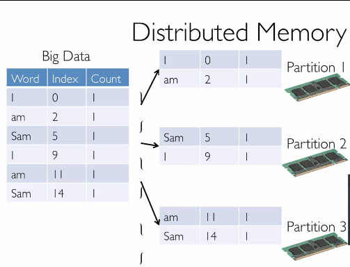
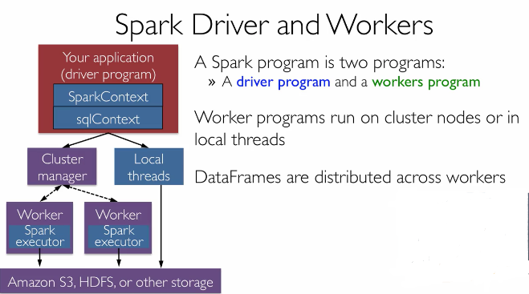
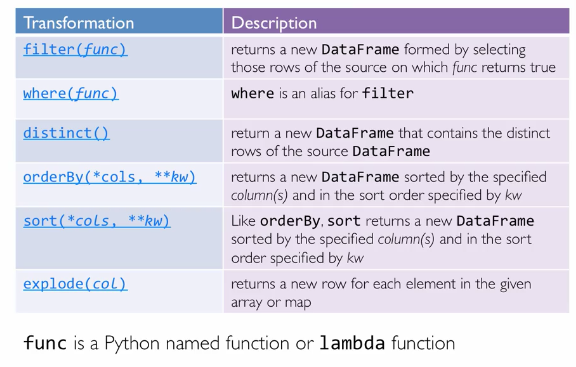
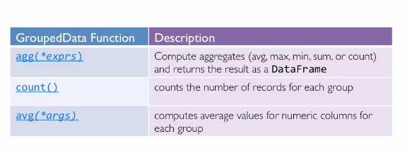
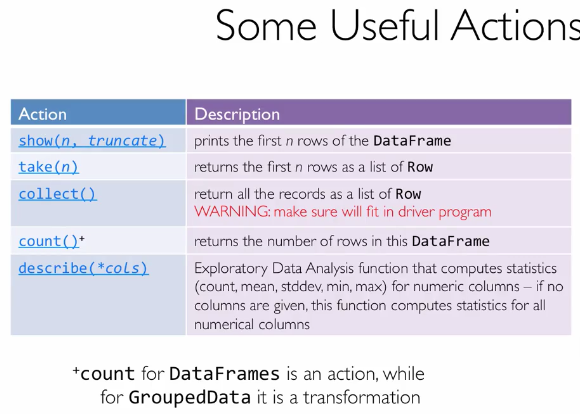
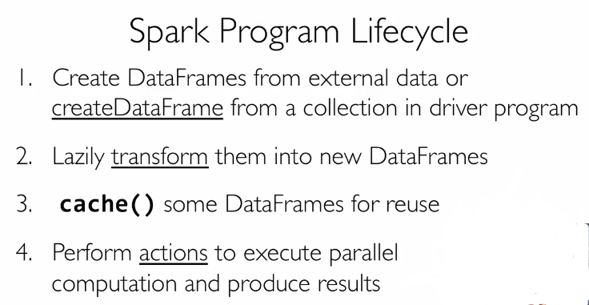
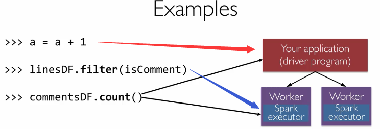

## 简介

大数据无处不在，只要你还在网上，就无法避免，同时在其他领域也有产生非常多的数据。

数据分为结构化的，半结构化的和无结构的，无结构化的数据又占据了总数据的大部分，我们通常需要将无结构化的数据转换成结构化的数据，这就需要用到spark这个工具了。

半结构化的数据在于，不一定需要有schema，可以从数据中动态推断出来，比如一个data.frame，而结构化的数据必须先要有一个schema。

Apache Spark components

1. Spark SQL
2. Spark Streaming
3. MLib & ML
4. GraphX
5. Apach Spark

1和5是本课程所交内容

**SparkContext**对象告诉spark如何以及在哪去获取一个集群。

**sqlContext**用来创建DataFrame

下图就是spark dataframe工作的原理






## Spark中的DataFrame

一旦建立是不可改变的，一个Row对象. `row = Row(name="alice", age=11); row.name`

track lineage information可以帮助data.frame重建丢失的数据

- 两种操作类型

*transformation*, *actions*，只有加上一个action操作，sqlContext才执行所有操作。

- 读取数据

```
sqlContext.createDataframe(list, pandas)
sc.read.text(plain_text)
```

## Spark Transformation

transformation可以从现有的dataFrame中创建新的dataFrame。

User Defined Function, UDF

udf(func, spark_type)



demo: 将年龄乘以2

```
data = [("alice", 1), ("queue", 2), ("queue", 2)]
df = sc.createDataFrame(
	data,
	["name", "age"]
)
from pyspark.sql.types import IntegerType
doubled = udf(lambda s: s * 2, IntegerType())
df2 = df.select(df.name, doubled(df.age).alias("age"))
```

explode 将一行中具有list的做成类似melt操作

group 数据



## Spark actions

在生产环境中不要使用collect，很容易出内存溢出的错误，是程序崩溃。只有在debug的时候使用比较好。






spark会使用driver和worker上面的资源，但是一般数据量大的操作是应该放在worker机器上面，所以不要使用collect，同时如果需要做transformation操作功能，查看API资料会比较好，免得一些语句导致在driver机器上执行，使得程序变慢或者直接内存爆满。



## 参考资料

1. [官方文档介绍][1]


[1]: https://spark.apache.org/docs/latest/sql-programming-guide.html