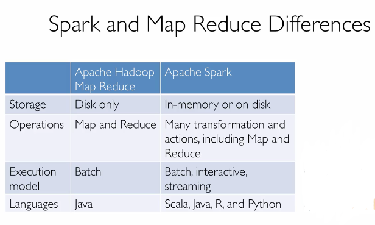

## The big data problem

  can't process all the data on one single machine.

## Modern Cluster

**Scalable**

1. 用普通的硬件
2. 用复杂的软件
3. 易于扩展

cheap hardware problems

1. failures
2. network
3. uneven

How to split work across machine?

map + reduce

用hash表，然后分别存在不同的机器上面，并且存在不同的机器上面（Map->Reduce），从而不会使得机器结果汇集在同一台机器上而死机。

尽量在本机工作，减少网络传输数据。

碰到死机，在另外一台机器重启一个任务
碰到缓慢的计算机器，超过一定时限，同样方式重启一个任务。

**Efficient**

memory > hard drive > network

Map Reduce涉及了太多的磁盘IO，导致速度很慢

Apache Spark用内存存储数据，保证只在开始的时候读取磁盘中的数据，其后数据都是在内存中，所以速度快。

两种方式比较：

另外spark使用更少的代码，lazy evaluation，lower overhead, less cost of shuffing.

最近spark加入两个重要性能优化

+ Catalyst Optimization Engine
+ Project Tungsten off-heap memory management
  + 相较于java的对象存储，使用了一种更加紧凑的存储方式
  + less gc

**关系型数据库**

+ Schema
+ Instance
  #rows = cardinality
  #fields = degree

Spark SQL和普通的SQL的区别在于没有**DELETE**操作，DataFrame一旦创建就不会改变，只有通过建立新的DataFrame来改变其值，Spark保证这其中的有效性，如何不会创建多个copy导致效率降低。

一些重要的模块

[pyspark sql](http://spark.apache.org/docs/latest/api/python/pyspark.sql.html)

常见的操作函数可以在`pyspark.sql.functions`里面查找，同时对数据变形可以用`select`来做，并且用`col`来指定列是比较方便的一个选择。